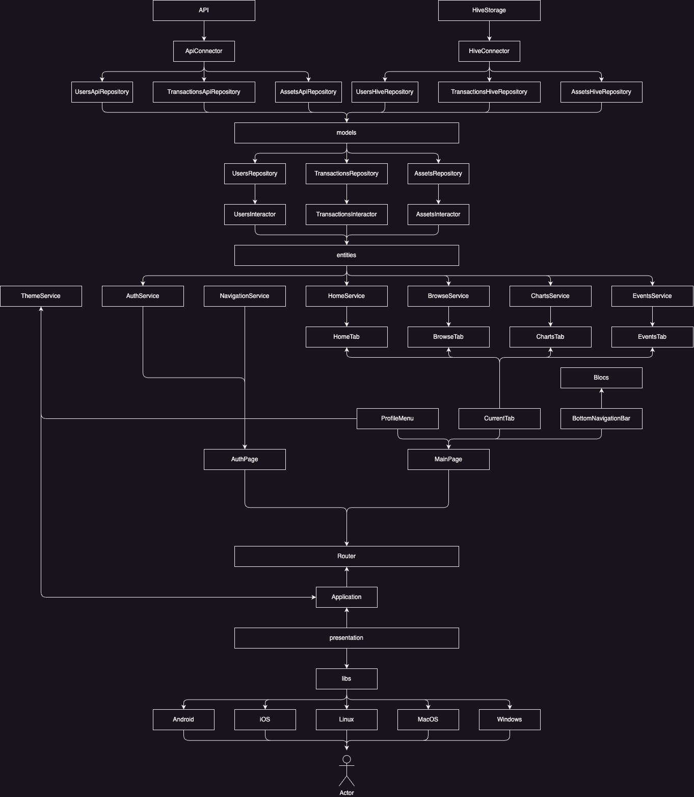

# Stock Market Mobile

Cross-Platform application for stocks management.

## Getting Started

This project is a starting point for a Flutter application.

A few resources to get you started if this is your first Flutter project:

- [Lab: Write your first Flutter app](https://docs.flutter.dev/get-started/codelab)
- [Cookbook: Useful Flutter samples](https://docs.flutter.dev/cookbook)

For help getting started with Flutter development, view the
[online documentation](https://docs.flutter.dev/), which offers tutorials,
samples, guidance on mobile development, and a full API reference.

## Architecture Overview



```bash
libs/
  core/
    constants/              # Route names, providers, enums
    services/               # App-wide helpers (navigation, theming)
    theme/                  # Colors, theme definitions
    utils/                  # Generic helpers
  data/
    datasources/            # Interfaces to external systems (Hive, API)
    repositories/           # Implement domain repositories using datasources
    models/                 # DTOs for data layer only
  domain/
    entities/               # Business objects
    repositories/           # Abstract contracts
    usecases/               # Business logic/application logic
  presentation/
    blocs/                  # State management (BLoC)
      events/               # State Changing Events
      states/               # Applcation States
    pages/                  # UI pages
    widgets/                # Reusable UI components
  application.dart          # Core Widget
  main.dart                 # Application Entry Point
```

## Project Features:

### Step One:
- [x] Create Project
- [x] Planing Workflows
- [ ] API Integration
- [ ] Home Screen Page UI
- [ ] Stocks Search

### Step Two:
- [ ] Theme Integration
- [ ] Auth & Profile
- [ ] Graphics on Home Page
